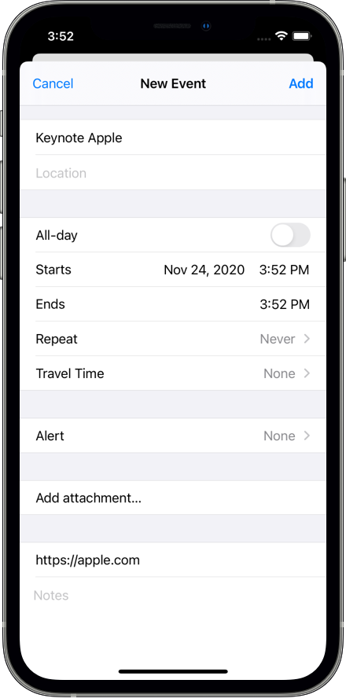

# Calendar-Event
This is an example on how to integrate EventKit with Swift 5. The project is set up to present to request 
authorization to the user and add a default event with title, URL, start & end time  to the calendar thanks to EKEventEditViewDelegate. 

Here is how it look's like:

